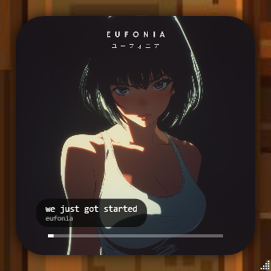
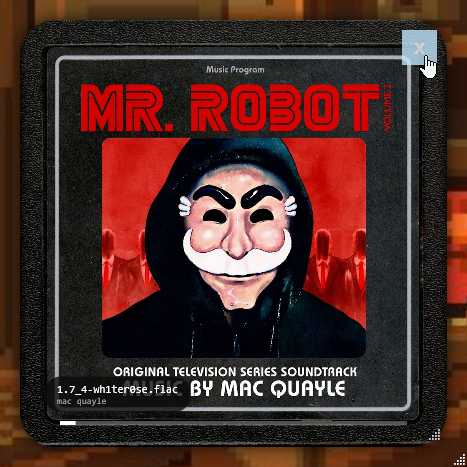
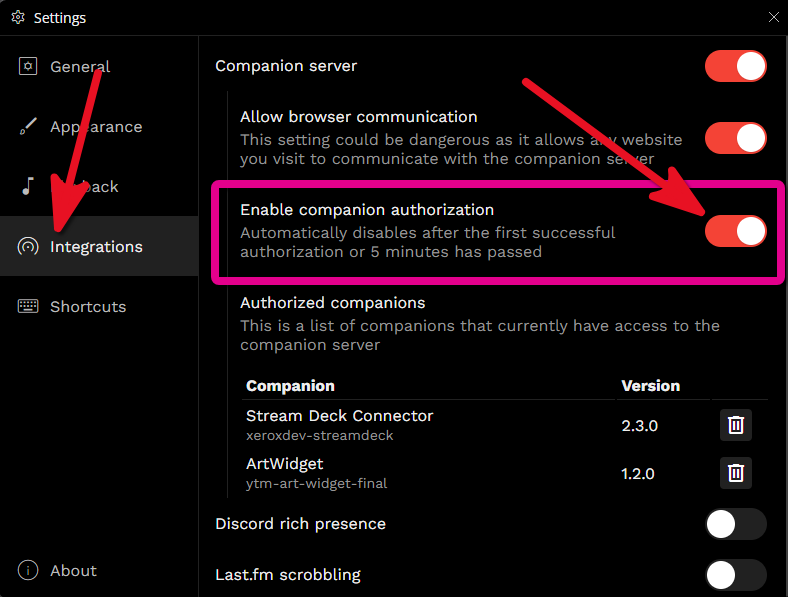
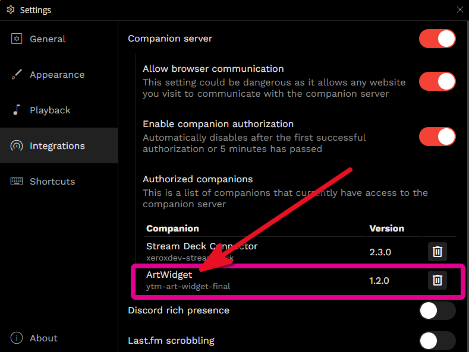

# YTM Art Mode Widget

Pure album art, zero UI. A completely borderless, resizable companion widget for YouTube Music Desktop with a modern Lofi aesthetic.

---

## 📸 Preview

### Pure Art Mode
Experience your music with a clean, high-resolution album art focus. Perfect for second monitors and aesthetic gaming setups.

### Distraction-Free UI
The close button and resize grip remain hidden until you hover your mouse, ensuring zero clutter while you listen.

---

## 🛠️ Requirements

- **OS:** Windows 10 or Windows 11.
- **App:** [YouTube Music Desktop App (NovusTheory/ytmdesktop)](https://ytmdesktop.app/) v2.0 or higher.
- **Integration:** You must enable the **Companion Server** in your app settings:

---

## 🚀 Setup Instructions

1. **Enable the API:**
   - Open YouTube Music Desktop.
   - Go to **Settings** -> **Integrations**.
   - Toggle **Companion Server** to **ON**.
   - Toggle **Enable Companion Authorization** to **ON**.

   

1. **Launch the Widget:**
   - Download this repository folder.
   - Double-click **`YTM-Art-Widget-Launcher.vbs`**.
   - **Check your YouTube Music App:** A popup will appear asking to authorize "ArtWidget." Click **Approve**. Once connected, it will appear in your authorized list:

3. **Enjoy!**
   - The art will appear within a few seconds. 
   - Drag to move, drag corners to resize.
   - **Hover** over the window to see the Close (X) button.

---

## 📜 License

This project is licensed under the [MIT License](LICENSE). 
Created by James Bratton.
